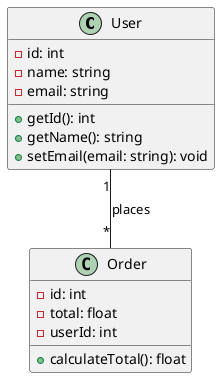

# UML2Code

A comprehensive web application that transforms UML class diagrams into production-ready source code across multiple programming languages. Built with Symfony 7.2 and modern web technologies.

Developer Documentation: https://deepwiki.com/t0nn1x/uml2code

## Overview

UML2Code simplifies software development by automatically generating clean, well-structured code from PlantUML class diagrams. Whether you're prototyping, documenting existing systems, or kickstarting new projects, UML2Code bridges the gap between design and implementation.

### Key Features

- **Multi-Language Support**: Generate code in PHP, Java, Python, and C# with more languages coming soon
- **PlantUML Integration**: Use familiar PlantUML syntax with real-time syntax highlighting
- **Advanced Code Generation**: Support for inheritance, interfaces, generics, relationships, and design patterns
- **Monaco Editor**: Rich code editing experience with syntax highlighting and error detection
- **User Dashboard**: Track your projects, view statistics, and manage conversion history
- **API Access**: RESTful APIs for programmatic integration
- **Internationalization**: Full support for English and Ukrainian languages
- **Theme Support**: Light and dark mode with persistent user preferences

### Supported Languages

| Language | Versions | Features |
|----------|----------|----------|
| **PHP** | 7.4, 8.0, 8.1, 8.2 | Namespaces, type hints, PSR-12 compliance |
| **Java** | 8, 11, 17, 21 | Packages, generics, annotations |
| **Python** | 3.8, 3.9, 3.10, 3.11 | Type hints, dataclasses, PEP 8 formatting |
| **C#** | 6.0, 7.0, 8.0, 9.0 | Namespaces, properties, attributes |

## Quick Start

### Prerequisites

- Docker 20.10+ and Docker Compose 2.0+
- Git 2.30+

### Installation

```bash
# Clone the repository
git clone https://github.com/your-org/uml2code.git
cd uml2code

# Start the application
docker-compose up -d

# Install dependencies
docker-compose exec php composer install

# Run database migrations
docker-compose exec php bin/console doctrine:migrations:migrate --no-interaction

# Load sample data (optional)
docker-compose exec php bin/console doctrine:fixtures:load --no-interaction
```

### Access the Application

- **Web Interface**: http://localhost:8080
- **Mail Testing**: http://localhost:8025 (MailHog)
- **Database**: localhost:5432 (PostgreSQL)

## Usage Examples

### Basic UML to PHP Conversion

1. **Create a UML diagram**:


2. **Generated PHP code**:
```php
<?php

namespace App\Entity;

class User
{
    private int $id;
    private string $name;
    private string $email;

    public function getId(): int
    {
        return $this->id;
    }

    public function getName(): string
    {
        return $this->name;
    }

    public function setEmail(string $email): void
    {
        $this->email = $email;
    }
}
```

### API Usage

```bash
# Convert UML to PHP code
curl -X POST http://localhost:8080/api/converter/convert \
  -H "Content-Type: application/json" \
  -d '{
    "uml": "@startuml\nclass User {\n  +id: int\n}\n@enduml",
    "language": "PHP",
    "version": "8.2"
  }'
```

## Architecture

UML2Code follows Domain-Driven Design (DDD) principles with clean architecture:

```
src/
├── Core/                    # Business logic (DDD bounded contexts)
│   ├── Parser/             # UML parsing functionality
│   ├── Generator/          # Code generation functionality
│   └── Converter/          # Direct UML-to-code conversion
├── Controller/             # Web controllers and API endpoints
├── Entity/                 # Data model (Doctrine entities)
├── Service/                # Application services
└── Security/               # Authentication and authorization
```

### Core Components

- **Parser**: Converts PlantUML diagrams to structured JSON data
- **Generator**: Transforms JSON data into source code files
- **Converter**: Combines parsing and generation for direct conversion

## Development

### Development Setup

```bash
# Clone and setup
git clone https://github.com/your-org/uml2code.git
cd uml2code

# Copy environment file
cp .env.example .env

# Start development environment
docker-compose up -d

# Install dependencies
docker-compose exec php composer install

# Run migrations
docker-compose exec php bin/console doctrine:migrations:migrate

# Run tests
docker-compose exec php bin/phpunit
```

## Documentation

Documentation is available in the `/doc` directory:

## API Reference

### Core Endpoints

| Endpoint | Method | Description |
|----------|--------|-------------|
| `/api/parser/parse` | POST | Parse UML to JSON |
| `/api/generator/generate` | POST | Generate code from JSON |
| `/api/converter/convert` | POST | Direct UML to code conversion |
| `/api/dashboard/summary` | GET | User statistics and activity |

### Authentication

The API supports multiple authentication methods:
- Session-based authentication (web interface)
- OAuth2 (GitHub, Google)
- Traditional email/password

## Contributing

We welcome contributions! Please see our [Development Guide](doc/DEVELOPMENT_GUIDE.md) for detailed information.

### Quick Contribution Steps

1. Fork the repository
2. Create a feature branch (`git checkout -b feature/amazing-feature`)
3. Make your changes with tests
4. Ensure code quality (`composer run-script cs-fix`)
5. Commit your changes (`git commit -m 'Add amazing feature'`)
6. Push to the branch (`git push origin feature/amazing-feature`)
7. Open a Pull Request

### Development Standards

- Follow PSR-12 coding standards
- Write comprehensive tests
- Update documentation for new features
- Use conventional commit messages

## Technology Stack

- **Backend**: Symfony 7.2, PHP 8.4+
- **Database**: PostgreSQL 16 with Doctrine ORM
- **Frontend**: Monaco Editor 0.45.0, Tailwind CSS
- **Infrastructure**: Docker, Nginx, PHP-FPM
- **Testing**: PHPUnit, Symfony Test Framework

### Environment Variables

```bash
OAUTH_GOOGLE_CLIENT_ID=your-google-client-id
OAUTH_GOOGLE_CLIENT_SECRET=your-google-client-secret
OAUTH_GITHUB_CLIENT_ID=your-github-client-id
OAUTH_GITHUB_CLIENT_SECRET=your-github-client-secret

MAILER_DSN=smtp://mailhog:1025

LOG_RETENTION_DAYS=30
```

## Security

- All inputs are validated and sanitized
- CSRF protection on all forms
- Secure password hashing
- OAuth2 integration with major providers
- Role-based access control

## Performance

- Optimized database queries with proper indexing
- Caching for expensive operations
- Streaming output for large files
- CDN integration for static assets

## License

This project is licensed under the MIT License - see the [LICENSE](LICENSE) file for details.

## Support

- **Documentation**: Comprehensive guides in `/doc` directory
- **Issues**: Report bugs and request features on GitHub Issues

## Roadmap

### Upcoming Features

- **Additional Languages**: TypeScript, Go, Rust support
- **Advanced UML Features**: Sequence diagrams, use case diagrams
- **Team Collaboration**: Shared projects and real-time collaboration
- **API Integrations**: GitHub, GitLab repository integration
- **Enterprise Features**: SSO, advanced analytics, audit logs

### Recent Updates

- **v1.0.0**: Initial release with PHP, Java, Python, C# support
- **v1.1.0**: Added user dashboard and project history
- **v1.2.0**: OAuth integration and improved Monaco Editor

## Acknowledgments

- [PlantUML](https://plantuml.com/) for the excellent UML syntax
- [Monaco Editor](https://microsoft.github.io/monaco-editor/) for the powerful code editor
- [Symfony](https://symfony.com/) framework for the solid foundation
- All contributors who have helped improve this project

---
